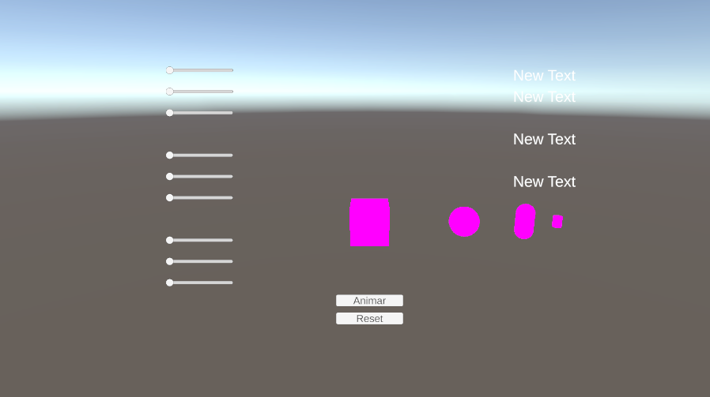
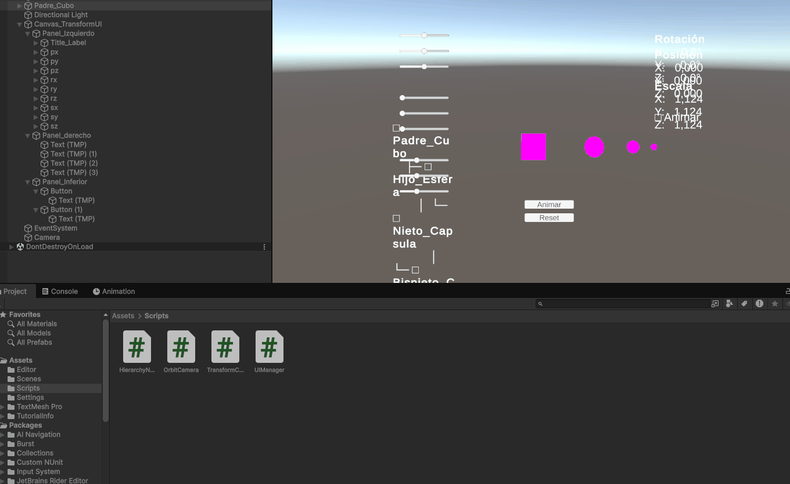

# Taller Jerarquias Transformaciones

**Estudiante:** Jerónimo Bermúdez Hernández  
**Fecha de entrega:** 21 de febrero de 2026

---

## Descripción

Este taller explora el uso de estructuras jerárquicas y árboles de transformación para organizar escenas 3D y simular movimiento relativo entre objetos. El objetivo principal es comprender cómo las transformaciones aplicadas a nodos padre afectan a sus hijos en una estructura jerárquica, y cómo visualizar estos efectos en tiempo real mediante controles interactivos.

Se implementaron soluciones en Two diferentes plataformas (Three.js y Unity) que demuestran cómo las transformaciones de rotación, traslación y escala se propagan a través de la jerarquía de objetos, permitiendo crear animaciones complejas mediante operaciones simples en los nodos padre.

---

## Implementaciones

### 1. Three.js con React Three Fiber

**Plataforma:** Web  
**Tecnologías:** Vite, React, React Three Fiber, @react-three/drei, Leva

#### Funcionalidades implementadas:

- Estructura jerárquica de 3 niveles usando componentes `<group>`
- Transformaciones interactivas en tiempo real con controles Leva
- Tres niveles de jerarquía:
  - **Nivel 1 (Parent):** Cubo rojo - Nodo raíz
  - **Nivel 2 (Child):** Cilindro verde - Hijo del cubo
  - **Nivel 3 (Grandchild):** Esfera azul con satélite - Nieto de la jerarquía
- Controles independientes para cada nivel:
  - Traslación en ejes X, Y, Z
  - Rotación en ejes X, Y, Z
- Visualización de herencia de transformaciones
- OrbitControls para exploración libre de la escena
- Grid de referencia para orientación espacial
- Ejes de coordenadas (axesHelper) en el nodo padre
- Etiquetas de texto para identificar cada objeto

#### Características técnicas:

- Uso de `useControls` de Leva para UI de controles
- Componente `HierarchyScene` que gestiona la jerarquía
- Transformaciones acumulativas: cada hijo hereda las transformaciones de su padre
- Iluminación ambiental y direccional para mejor visualización
- Materiales `MeshStandardMaterial` para renderizado realista

#### Observaciones del comportamiento:

- Cuando el padre rota, todos los hijos rotan con él manteniendo su posición relativa
- Las traslaciones del padre mueven todo el árbol jerárquico
- Los hijos pueden tener sus propias transformaciones locales independientes
- Las transformaciones se encadenan multiplicativamente a través de los niveles

**Código relevante:** Ver carpeta [threejs/](threejs/)

### 2. Unity (LTS)

**Plataforma:** Unity Editor  
**Tecnologías:** Unity 2022 LTS, C#, Unity UI

#### Funcionalidades implementadas:

- Escena 3D con jerarquía de 3 objetos anidados:
  - **Parent:** Cubo rojo (padre)
  - **Child:** Esfera verde (hijo del cubo)
  - **Grandchild:** Cilindro azul (nieto)
- Script en C# `TransformController.cs` para control de transformaciones
- Panel UI con sliders para controlar:
  - Posición X, Y, Z del padre
  - Rotación X, Y, Z del padre
  - Escala X, Y, Z del padre
- Visualización de valores actuales de transformación en la UI
- Sistema de animación automática con control de pausa/reinicio
- Visualización de ejes de coordenadas
- Cámara orbital para exploración de la escena

#### Características técnicas:

- Script `TransformController` vinculado al objeto padre
- UI Canvas con sliders que modifican valores en tiempo real
- Uso de `Transform.localPosition`, `Transform.localRotation` y `Transform.localScale`
- Sistema de animación opcional con interpolación suave
- Texto UI que muestra valores numéricos de las transformaciones

#### Observaciones del comportamiento:

- Los sliders modifican únicamente el objeto padre
- Los objetos hijo y nieto heredan automáticamente las transformaciones
- El sistema de coordenadas local permite movimientos relativos
- La animación automática demuestra la propagación continua de transformaciones

**Código relevante:** Ver carpeta [unity/Assets/Scripts/](unity/Assets/Scripts/)

---

## Resultados Visuales

### Three.js - Jerarquía Interactiva Web


*Fig 1: Interfaz del visualizador Three.js con controles Leva para cada nivel de jerarquía*


*Fig 2: Demostración de transformaciones heredadas en Three.js - observa cómo la rotación del padre afecta a todos los hijos*

### Unity - Jerarquía con Controles UI


*Fig 3: Escena de Unity mostrando la jerarquía de objetos y el panel de controles con sliders*


*Fig 4: Manipulación de transformaciones en Unity mediante sliders - visualización de herencia jerárquica*

---

## Código Relevante

### Three.js - Estructura jerárquica con grupos

```jsx
<group
  ref={parentRef}
  position={[
    parentTransform.positionX,
    parentTransform.positionY,
    parentTransform.positionZ
  ]}
  rotation={[
    parentTransform.rotationX,
    parentTransform.rotationY,
    parentTransform.rotationZ
  ]}
>
  {/* Parent object - Red Cube */}
  <mesh castShadow receiveShadow>
    <boxGeometry args={[1, 1, 1]} />
    <meshStandardMaterial color="#ff4757" />
  </mesh>

  {/* Child group (Level 2) */}
  <group
    ref={childRef}
    position={[
      childTransform.positionX,
      childTransform.positionY,
      childTransform.positionZ
    ]}
    rotation={[
      childTransform.rotationX,
      childTransform.rotationY,
      childTransform.rotationZ
    ]}
  >
    {/* Child object - Green Cylinder */}
    <mesh castShadow receiveShadow>
      <cylinderGeometry args={[0.4, 0.4, 1.5, 32]} />
      <meshStandardMaterial color="#2ed573" />
    </mesh>

    {/* Grandchild group (Level 3) */}
    <group
      ref={grandchildRef}
      position={[
        grandchildTransform.positionX,
        grandchildTransform.positionY,
        grandchildTransform.positionZ
      ]}
      rotation={[
        grandchildTransform.rotationX,
        grandchildTransform.rotationY,
        grandchildTransform.rotationZ
      ]}
    >
      {/* Grandchild object - Blue Sphere */}
      <mesh castShadow receiveShadow>
        <sphereGeometry args={[0.5, 32, 32]} />
        <meshStandardMaterial color="#5352ed" />
      </mesh>
    </group>
  </group>
</group>
```

### Three.js - Configuración de controles con Leva

```jsx
const parentControls = useControls('Parent (Level 1)', {
  positionX: { value: 0, min: -5, max: 5, step: 0.1 },
  positionY: { value: 0, min: -5, max: 5, step: 0.1 },
  positionZ: { value: 0, min: -5, max: 5, step: 0.1 },
  rotationX: { value: 0, min: 0, max: Math.PI * 2, step: 0.01 },
  rotationY: { value: 0, min: 0, max: Math.PI * 2, step: 0.01 },
  rotationZ: { value: 0, min: 0, max: Math.PI * 2, step: 0.01 },
})
```

### Unity C# - Control de transformaciones con sliders

```csharp
using UnityEngine;
using UnityEngine.UI;

public class TransformController : MonoBehaviour
{
    [Header("UI Sliders")]
    public Slider positionXSlider;
    public Slider positionYSlider;
    public Slider positionZSlider;
    public Slider rotationXSlider;
    public Slider rotationYSlider;
    public Slider rotationZSlider;

    void Update()
    {
        // Update position from sliders
        transform.localPosition = new Vector3(
            positionXSlider.value,
            positionYSlider.value,
            positionZSlider.value
        );

        // Update rotation from sliders
        transform.localEulerAngles = new Vector3(
            rotationXSlider.value,
            rotationYSlider.value,
            rotationZSlider.value
        );
    }
}
```

---

## Prompts Utilizados

Durante el desarrollo de este taller se utilizaron prompts de IA generativa para:

1. **Configuración inicial del proyecto Three.js**
   - "Crear un proyecto con Vite, React y React Three Fiber para demostrar jerarquías de transformación"
   - "Configurar Leva para controles interactivos en React Three Fiber"

2. **Implementación de jerarquías en Three.js**
   - "Cómo crear una estructura padre-hijo-nieto usando groups en React Three Fiber"
   - "Aplicar transformaciones independientes a cada nivel de jerarquía"
   - "Demostrar herencia de transformaciones en estructuras jerárquicas 3D"

3. **Sistema de controles**
   - "Configurar controles Leva con sliders para posición y rotación"
   - "Crear paneles separados en Leva para cada nivel de jerarquía"
   - "Actualizar transformaciones en tiempo real desde controles UI"

4. **Unity - Jerarquías y scripting**
   - "Crear script en C# para controlar transformaciones de objeto padre en Unity"
   - "Vincular sliders de Unity UI con valores de Transform"
   - "Mostrar valores de transformación en texto UI"
   - "Implementar sistema de animación con pausa/reinicio en Unity"

5. **Conceptos teóricos**
   - "Explicar cómo funcionan las transformaciones jerárquicas en motores 3D"
   - "Diferencia entre coordenadas locales y globales en jerarquías"
   - "Cómo se multiplican las matrices de transformación en una jerarquía padre-hijo"

6. **Documentación**
   - "Estructura de README para proyecto de jerarquías y transformaciones 3D"
   - "Explicar la propagación de transformaciones en un árbol de escena"

---

## Aprendizajes y Dificultades

### Aprendizajes clave:

1. **Jerarquías y grafos de escena:**
   - Comprendí que un grafo de escena organiza objetos en una estructura de árbol donde cada nodo tiene transformaciones relativas a su padre.
   - Las transformaciones se acumulan multiplicativamente: la transformación mundial de un objeto es el producto de todas las transformaciones desde la raíz hasta ese nodo.
   - Este sistema permite crear movimientos complejos (como un sistema solar, un brazo robótico, etc.) mediante operaciones simples en nodos específicos.

2. **Coordenadas locales vs globales:**
   - **Coordenadas locales**: Relativas al padre inmediato. Útiles para definir relaciones entre objetos.
   - **Coordenadas globales**: Relativas al origen del mundo. Representan la posición final después de aplicar todas las transformaciones heredadas.
   - Modificar la posición local de un hijo no afecta al padre, pero modificar el padre afecta a todos sus descendientes.

3. **Propagación de transformaciones:**
   - Si un padre rota 45°, todos sus hijos rotan 45° manteniendo su orientación relativa.
   - La traslación del padre desplaza todo el subárbol sin cambiar las posiciones relativas.
   - La escala del padre afecta tanto el tamaño como las distancias relativas de los hijos.

4. **Diferencias entre plataformas:**
   - **Three.js/React**: Uso de componentes `<group>` para crear jerarquías. Los props `position`, `rotation` y `scale` se heredan automáticamente.
   - **Unity**: Jerarquía visual en el editor. El componente `Transform` maneja automáticamente la herencia. Los hijos aparecen indentados bajo el padre en la jerarquía.

5. **Aplicaciones prácticas:**
   - Animación de personajes (esqueleto con huesos jerárquicos)
   - Sistemas mecánicos (brazos robóticos, vehículos con ruedas)
   - Interfaces de usuario (ventanas con botones hijos)
   - Sistemas planetarios y astronómicos

### Dificultades encontradas:

1. **Comprensión inicial de coordenadas relativas:**
   - Al principio fue confuso entender por qué un hijo en posición (2, 0, 0) no aparecía en esa posición global.
   - Solución: Visualizar los ejes de coordenadas (axesHelper) ayudó a entender que la posición del hijo es relativa al sistema de coordenadas del padre.

2. **Control de múltiples niveles en Three.js:**
   - Gestionar tres conjuntos de controles diferentes (parent, child, grandchild) resultó verboso.
   - Solución: La librería Leva organiza automáticamente los controles en paneles colapsables, mejorando la UI.

3. **Sincronización de sliders en Unity:**
   - Los sliders necesitaban rangos apropiados para cada tipo de transformación (posición, rotación, escala).
   - Solución: Configurar rangos diferentes: posición [-10, 10], rotación [0, 360], escala [0.1, 3].

4. **Visualización de la herencia:**
   - No era obvio a simple vista cómo las transformaciones se propagaban.
   - Solución: Usar colores diferentes para cada nivel y agregar etiquetas de texto para identificación clara.

5. **Referencias de objetos en React:**
   - Necesitaba mantener referencias a los grupos para posibles animaciones futuras.
   - Solución: Usar `useRef()` para cada nivel de la jerarquía, aunque en este caso no fue necesario acceder directamente a ellos.

6. **Performance con actualizaciones continuas:**
   - En Unity, actualizar el Transform en cada frame de Update() podía ser costoso.
   - Solución: Solo actualizar cuando los valores de los sliders cambian (detectar cambios con tolerancia).

### Reflexión final:

Este taller fue fundamental para entender uno de los conceptos más importantes en computación gráfica 3D: las jerarquías de transformación. La capacidad de organizar escenas en estructuras padre-hijo no solo facilita la organización del código, sino que permite crear animaciones y movimientos complejos de manera eficiente y escalable.

La implementación en dos plataformas diferentes (web con Three.js y motor de juegos con Unity) demostró que este concepto es universal en el mundo 3D, con ligeras variaciones en la sintaxis pero con la misma lógica subyacente. Esta experiencia será valiosa para proyectos futuros que requieran modelado, animación o simulación de sistemas complejos.

---

## Conclusiones

Las jerarquías de transformación son la base de la organización en escenas 3D complejas. Comprender cómo se propagan las transformaciones a través de un árbol de escena permite:

- Crear animaciones complejas con código simple
- Organizar escenas de manera lógica y mantenible
- Simular sistemas físicos con relaciones entre componentes
- Facilitar la manipulación de grupos de objetos relacionados

Tanto Three.js como Unity implementan este sistema de manera robusta, demostrando que es un estándar de la industria para organización de escenas 3D.
