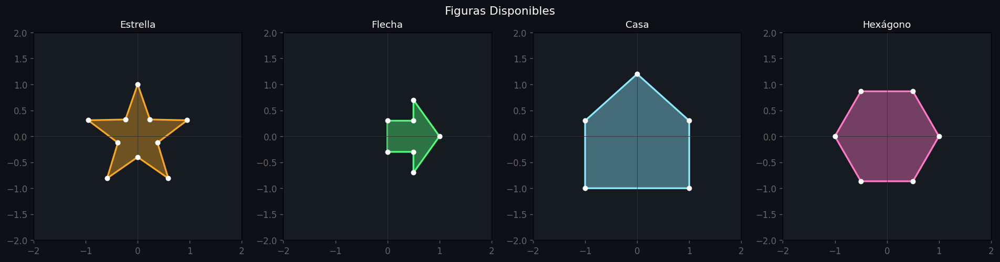
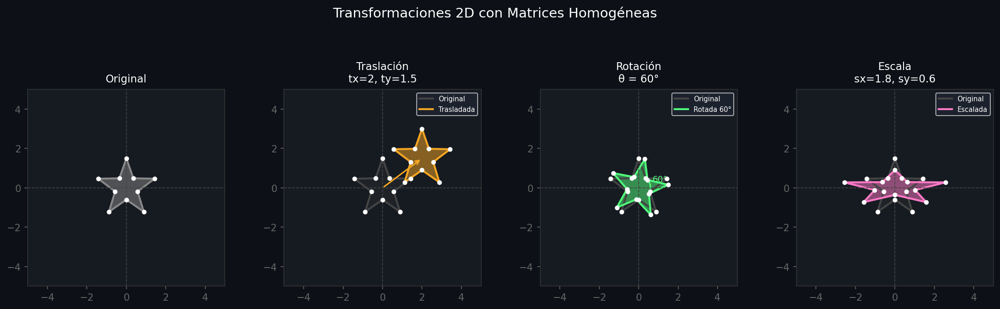
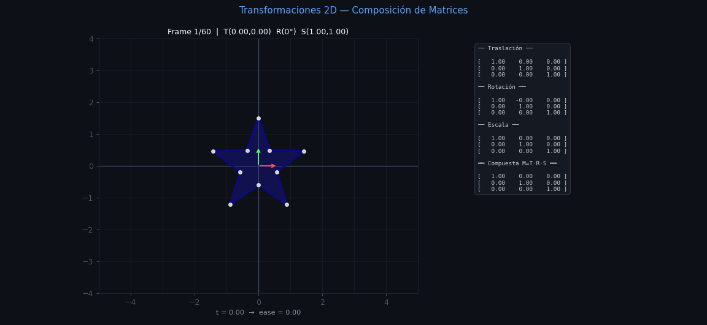
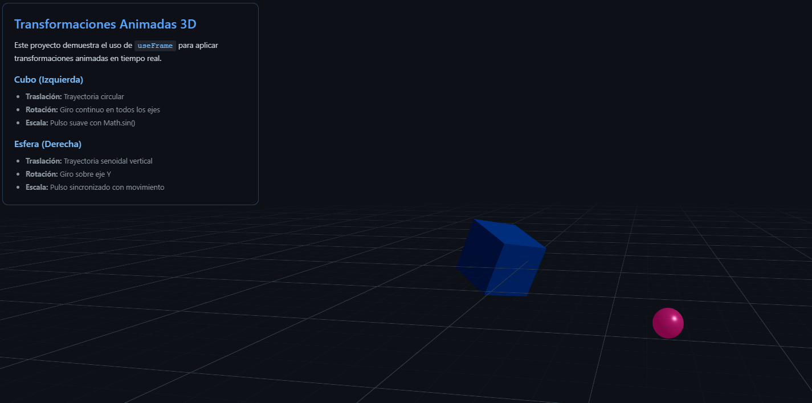
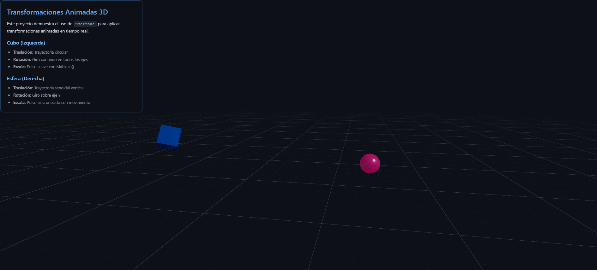

# Taller Transformaciones

**Estudiante:** Jerónimo Bermúdez Hernández  
**Fecha de entrega:** 21 de febrero de 2026

---

## Descripción

Este taller explora los conceptos fundamentales de **transformaciones geométricas** en computación visual: traslación, rotación y escala. El objetivo es comprender cómo estas operaciones matemáticas permiten manipular objetos en el espacio, tanto en 2D como en 3D, utilizando matrices de transformación y funciones temporales para crear animaciones.

Se implementaron soluciones en Python (para transformaciones 2D con matrices homogéneas) y Three.js (para transformaciones 3D animadas en tiempo real), demostrando cómo las transformaciones pueden ser aplicadas de forma estática y dinámica, y cómo pueden componerse para crear efectos complejos.

---

## Implementaciones

### 1. Python con Jupyter Notebook

**Plataforma:** Jupyter Notebook / Google Colab  
**Tecnologías:** Python, NumPy, Matplotlib, Imageio, PIL

#### Funcionalidades implementadas:

- **Matrices de transformación homogéneas 2D (3x3)**:
  - Traslación: Desplazamiento en los ejes X e Y
  - Rotación: Giro antihorario alrededor del origen
  - Escala: Cambio de tamaño en cada dimensión
  - Transformaciones adicionales: Reflexión y cizalla (shear)
- **Figuras geométricas 2D**:
  - Estrella de n puntas
  - Flecha direccional
  - Casa (polígono)
  - Polígono regular (hexágono)
- **Composición de transformaciones**: `M = T · R · S`
- **Animación temporal**:
  - Interpolación lineal (lerp) entre valores inicial y final
  - Suavizado con easing (ease-in-out cúbico)
  - Generación de 60 frames con transformaciones progresivas
- **Visualización avanzada**:
  - Panel dual: figura transformada + matrices en tiempo real
  - Ejes locales transformados
  - Grilla de referencia
  - Barra de progreso visual
- **Exportación**:
  - GIF animado con ida y vuelta
  - Imágenes estáticas de transformaciones individuales
  - Gráficas de evolución temporal de elementos matriciales

#### Características técnicas:

- Uso de coordenadas homogéneas para unificar todas las transformaciones
- Multiplicación de matrices para composición de transformaciones
- Aplicación eficiente de transformaciones a arrays de puntos
- Sistema de colores con degradado plasma según el tiempo
- Renderizado con matplotlib y captura de frames en memoria

#### Ecuaciones matemáticas implementadas:

**Traslación:**
```
[1  0  tx]
[0  1  ty]
[0  0   1]
```

**Rotación (θ radianes):**
```
[cos(θ) -sin(θ)  0]
[sin(θ)  cos(θ)  0]
[  0       0     1]
```

**Escala:**
```
[sx  0  0]
[0  sy  0]
[0   0  1]
```

**Código relevante:** Ver notebook [python/T4S1.ipynb](python/T4S1.ipynb)

### 2. Three.js con React Three Fiber

**Plataforma:** Web  
**Tecnologías:** Vite, React, React Three Fiber, @react-three/drei, Three.js

#### Funcionalidades implementadas:

- **Dos objetos 3D animados independientemente**:
  - **Cubo azul**: Transformaciones complejas con trayectoria circular
  - **Esfera rosa**: Transformaciones con trayectoria senoidal vertical
- **Transformaciones animadas con `useFrame`**:
  - **Traslación**:
    - Cubo: Trayectoria circular paramétrica `(x=r·cos(ωt), z=r·sin(ωt))`
    - Esfera: Movimiento vertical senoidal `y=A·sin(ωt+φ)`
  - **Rotación**:
    - Cubo: Giro continuo en los tres ejes con velocidades diferentes
    - Esfera: Rotación sobre eje Y con inclinaciones suaves
  - **Escala**:
    - Cubo: Pulso independiente con `Math.sin()`
    - Esfera: Pulso sincronizado con el movimiento vertical
- **Elementos de escena**:
  - Iluminación múltiple (ambiental, direccional, puntual)
  - Grid infinito de referencia
  - OrbitControls para navegación interactiva
  - Panel informativo con descripciones
- **Materiales PBR** (Physically Based Rendering):
  - Propiedades de metalness y roughness
  - Emisión de luz en la esfera

#### Características técnicas:

- Hook `useFrame` con acceso a `clock.getElapsedTime()`
- Ecuaciones paramétricas para trayectorias
- Transformaciones acumulativas en cada frame
- Control de propiedades mediante refs de React
- Iluminación con colores temáticos (azul y rosa)

#### Ecuaciones de trayectorias implementadas:

**Trayectoria Circular (Cubo):**
```javascript
x = baseX + radius * Math.cos(angularSpeed * time)
z = baseZ + radius * Math.sin(angularSpeed * time)
```

**Trayectoria Senoidal (Esfera):**
```javascript
y = baseY + amplitude * Math.sin(frequency * time + phase)
```

**Escala Pulsante:**
```javascript
scale = baseScale + amplitude * Math.sin(frequency * time)
```

**Código relevante:** Ver carpeta [threejs/](threejs/)

---

## Resultados Visuales

### Python - Transformaciones 2D con Matrices


*Fig 1: Figuras geométricas 2D disponibles para transformaciones*


*Fig 2: Visualización estática de traslación, rotación y escala aplicadas individualmente*


*Fig 3: Animación de transformación compuesta T·R·S con matrices mostradas en tiempo real*

### Three.js - Transformaciones 3D Animadas


*Fig 4: Escena 3D con cubo y esfera aplicando transformaciones animadas*


*Fig 5: Demostración de trayectorias circular (cubo) y senoidal (esfera) con escalado dinámico*

---

## Código Relevante

### Python - Aplicación de transformación con matrices homogéneas

```python
def aplicar_transformacion(puntos, M):
    """
    Aplica la matriz M (3x3) a un array de puntos (N, 2).
    Retorna los puntos transformados (N, 2).
    """
    # Convertir a coordenadas homogéneas (N, 3)
    N = puntos.shape[0]
    hom = np.hstack([puntos, np.ones((N, 1))])  # (N, 3)
    # Aplicar M: (3,3) @ (3,N) → (3,N)
    transformados = (M @ hom.T).T                # (N, 3)
    return transformados[:, :2]                  # (N, 2)
```

### Python - Composición de transformaciones animadas

```python
def lerp(a, b, t):
    """Interpolación lineal entre a y b."""
    return a + (b - a) * t

def ease_in_out(t):
    """Suavizado cúbico para animaciones más naturales."""
    return t * t * (3 - 2 * t)

# En cada frame:
t = ease_in_out(t_raw)
tx  = lerp(TX_INICIO, TX_FIN, t)
ty  = lerp(TY_INICIO, TY_FIN, t)
ang = lerp(ANG_INICIO, ANG_FIN, t)
sx  = lerp(SX_INICIO, SX_FIN, t)
sy  = lerp(SY_INICIO, SY_FIN, t)

T_mat = mat_traslacion(tx, ty)
R_mat = mat_rotacion(ang)
S_mat = mat_escala(sx, sy)
M = T_mat @ R_mat @ S_mat  # Composición
```

### Three.js - Animación con useFrame

```javascript
useFrame(({ clock }) => {
  if (!meshRef.current) return
  const time = clock.getElapsedTime()

  // Traslación: Trayectoria circular
  const radius = 2.5
  const angularSpeed = 0.5
  const x = basePosition.x + radius * Math.cos(angularSpeed * time)
  const z = basePosition.z + radius * Math.sin(angularSpeed * time)
  meshRef.current.position.set(x, basePosition.y, z)

  // Rotación: Giro continuo
  meshRef.current.rotation.x += 0.01
  meshRef.current.rotation.y += 0.015
  meshRef.current.rotation.z += 0.007

  // Escala: Pulso suave
  const scale = 1.0 + 0.2 * Math.sin(2.0 * time)
  meshRef.current.scale.setScalar(scale)
})
```

### Three.js - Trayectoria senoidal

```javascript
// Movimiento vertical senoidal
const amplitude = 2.0       // Amplitud del movimiento
const frequency = 1.2       // Frecuencia (ciclos por segundo)
const phase = Math.PI / 4   // Desfase inicial

const y = basePosition.y + amplitude * Math.sin(frequency * time + phase)
meshRef.current.position.set(basePosition.x, y, basePosition.z)
```

---

## Prompts Utilizados

Durante el desarrollo de este taller se utilizaron prompts de IA generativa para:

1. **Implementación de matrices de transformación**
   - "Cómo implementar matrices de transformación homogéneas 2D en Python con NumPy"
   - "Aplicar matriz de transformación a múltiples puntos eficientemente"
   - "Composición de matrices: orden correcto para T·R·S"

2. **Animación temporal en Python**
   - "Generar GIF animado frame por frame con matplotlib y PIL"
   - "Implementar interpolación lineal y easing en Python"
   - "Mostrar matrices actualizadas en cada frame de animación"

3. **Visualización avanzada**
   - "Crear layout con dos paneles en matplotlib: figura y texto"
   - "Mostrar ejes locales transformados en visualización 2D"
   - "Diseño con tema oscuro para visualizaciones científicas"

4. **Three.js - Animaciones con useFrame**
   - "Implementar trayectoria circular paramétrica en React Three Fiber"
   - "Aplicar transformaciones en cada frame con useFrame"
   - "Diferencia entre transformaciones acumulativas e interpoladas"

5. **Ecuaciones de movimiento**
   - "Ecuaciones paramétricas para círculo y senoide"
   - "Cómo sincronizar escala con movimiento en animación"
   - "Implementar easing functions para animaciones suaves"

6. **Conceptos matemáticos**
   - "Por qué usar coordenadas homogéneas para transformaciones 2D"
   - "Orden de multiplicación de matrices en transformaciones compuestas"
   - "Diferencia entre transformación local y global"

---

## Aprendizajes y Dificultades

### Aprendizajes clave:

1. **Coordenadas homogéneas:**
   - Comprendí que agregar una tercera coordenada (siempre 1) permite representar traslaciones como multiplicaciones de matrices, unificando todas las transformaciones.
   - Sin coordenadas homogéneas, la traslación requeriría suma de vectores, complicando la composición.
   - La última fila `[0, 0, 1]` preserva la naturaleza homogénea durante las operaciones.

2. **Orden de composición de matrices:**
   - El orden importa: `T·R·S` ≠ `S·R·T`
   - `T·R·S` significa: primero escalar, luego rotar, finalmente trasladar
   - La multiplicación se lee de **derecha a izquierda** en el orden de aplicación
   - En coordenadas: `resultado = M · punto`, donde `M = T·R·S`

3. **Interpolación y easing:**
   - **Lerp** (interpolación lineal): Transición uniforme entre valores
   - **Easing**: Suaviza inicio y fin de animaciones para movimiento más natural
   - La función `ease_in_out(t) = t²(3-2t)` crea aceleración y desaceleración suaves

4. **Diferencias entre 2D y 3D:**
   - **2D (Python)**: Matrices 3×3, control frame por frame, exportación offline
   - **3D (Three.js)**: Transformaciones en tiempo real, 60fps, navegación interactiva
   - Ambos usan los mismos conceptos matemáticos fundamentales

5. **Trayectorias paramétricas:**
   - **Círculo**: `x=r·cos(t), y=r·sin(t)` → movimiento circular perfecto
   - **Senoide**: `y=A·sin(ωt)` → oscilación armónica simple
   - Modificar `ω` (frecuencia) cambia la velocidad, modificar `A` (amplitud) cambia la distancia

6. **useFrame en React Three Fiber:**
   - Se ejecuta 60 veces por segundo (60 fps típicamente)
   - Proporciona `clock.getElapsedTime()` para animaciones basadas en tiempo
   - Las transformaciones son **acumulativas**: cada frame modifica el estado actual
   - Necesario usar `useRef` para mantener referencias a los objetos 3D

### Dificultades encontradas:

1. **Generación eficiente de GIF animado:**
   - Renderizar 60 frames en matplotlib es lento (varios segundos por frame)
   - Solución: Reducir DPI a 90, optimizar el proceso de captura con `io.BytesIO()`
   - Añadir frames en reversa (`frames[::-1]`) para animación de ida y vuelta

2. **Layout dual en matplotlib:**
   - Combinar figura transformada y texto de matrices en la misma visualización
   - Solución: Usar `GridSpec` con proporciones de ancho 2:1, desactivar ejes en panel de texto

3. **Synchronización de escala con movimiento:**
   - Inicialmente la escala pulsaba de forma independiente, sin relación visual con el movimiento
   - Solución: Usar la misma función senoidal con la misma fase para el movimiento Y y la escala

4. **Ejes locales transformados:**
   - Mostrar cómo los ejes X e Y de la figura se transforman junto con ella
   - Solución: Aplicar la matriz de transformación a vectores unitarios `[0.6, 0]` y `[0, 0.6]`

5. **Orden de rotación en Three.js:**
   - Rotar en múltiples ejes simultáneamente puede producir resultados inesperados (gimbal lock)
   - Solución: Incrementar ángulos de rotación con velocidades diferentes para efecto visual interesante

6. **Performance en animación web:**
   - Con objetos complejos, la tasa de frames puede caer
   - Solución: Usar geometrías optimizadas, limitar el número de objetos, aprovechar GPU rendering

7. **Conversión de coordenadas homogéneas:**
   - Error común: olvidar dividir por la coordenada w (aunque en 2D siempre es 1)
   - Solución: Extraer solo las primeras dos columnas del resultado: `transformados[:, :2]`

### Reflexión final:

Este taller fue fundamental para entender la base matemática de las transformaciones en computación gráfica. Las **matrices de transformación** son el lenguaje universal que permite manipular objetos en el espacio, y su composición mediante multiplicación de matrices es una herramienta extremadamente poderosa.

Lo más valioso fue ver cómo los mismos conceptos se aplican tanto en 2D (Python/Matplotlib) como en 3D (Three.js), solo cambiando de matrices 3×3 a 4×4. También fue revelador comprender que las animaciones suaves no son solo interpolaciones lineales, sino que requieren **easing functions** para sentirse naturales.

La implementación en Python me dio un control fino sobre cada aspecto matemático, mientras que Three.js demostró cómo engines modernos abstraen muchos detalles pero siguen basándose en los mismos principios. Esta dualidad entre control bajo nivel y abstracción de alto nivel es esencial en el desarrollo de aplicaciones visuales.

---

## Conclusiones

Las transformaciones geométricas son la base de toda animación y manipulación de objetos en computación gráfica. Los conceptos aprendidos en este taller:

- **Traslación**: Cambio de posición en el espacio
- **Rotación**: Giro alrededor de un punto o eje
- **Escala**: Cambio de tamaño

Son universales y se aplican en:
- Videojuegos (movimiento de personajes y cámaras)
- Animación 3D (rigging y animación de personajes)
- Visualización científica (manipulación de datos geométricos)
- Realidad aumentada y virtual (tracking y renderizado)
- Diseño gráfico (transformación de elementos visuales)

El uso de **matrices** para representar transformaciones permite:
- Composición eficiente mediante multiplicación
- Hardware acceleration en GPU
- Transformaciones inversas calculables
- Representación compacta de operaciones complejas

Este conocimiento es fundamental para cualquier trabajo futuro en computación visual, gráficos 3D, y desarrollo de aplicaciones interactivas.
