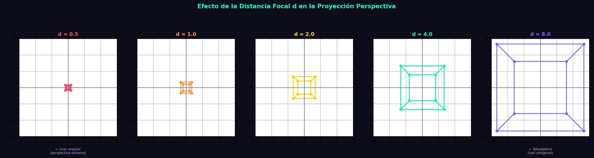
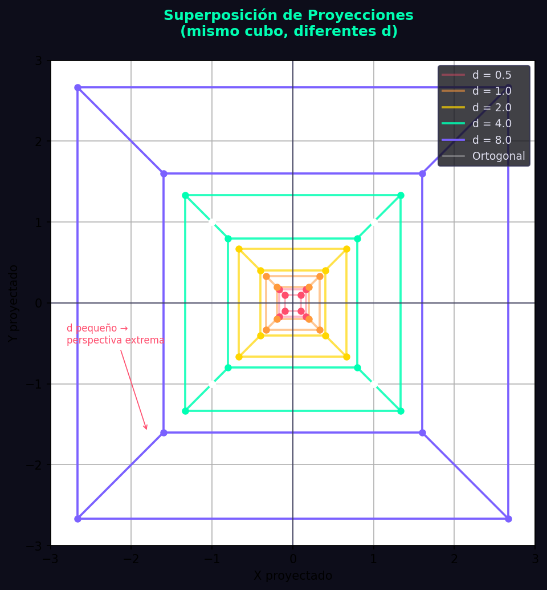

# Taller Espacios Proyectivos Matrices Proyeccion

**Estudiante:** Jerónimo Bermúdez Hernández  
**Fecha de entrega:** 25 de febrero de 2026

---

## Descripción

Este taller explora los conceptos fundamentales de **espacios proyectivos** y **matrices de proyección** en computación visual. El objetivo principal es comprender la diferencia entre proyección perspectiva y ortográfica, y cómo cada una afecta la percepción de profundidad y distancia en escenas 3D.

Se implementaron soluciones en Python (para análisis matemático de matrices de proyección) y Three.js (para visualización interactiva en tiempo real), demostrando cómo las matrices de proyección transforman coordenadas del espacio de vista al espacio de clip, y cómo estas transformaciones afectan la representación visual de objetos en diferentes profundidades.

---

## Implementaciones

### 1. Python con Jupyter Notebook

**Plataforma:** Jupyter Notebook  
**Tecnologías:** Python, NumPy, Matplotlib

#### Funcionalidades implementadas:

- **Matrices de proyección en 3D**:
  - Proyección perspectiva con parámetros configurables (FOV, aspect ratio, near, far)
  - Proyección ortográfica con volumen de vista definido
  - Comparación matemática entre ambos tipos de proyección
- **Visualización de efectos de proyección**:
  - Transformación de puntos 3D a espacio de clip
  - Comparación visual de objetos a diferentes profundidades
  - Gráficas que muestran cómo la distancia afecta el tamaño en pantalla
- **Análisis de parámetros**:
  - Efecto del campo de visión (FOV) en la proyección perspectiva
  - Impacto de los planos near y far
  - Diferencias en la preservación de proporciones
- **Casos de uso prácticos**:
  - Visualización de escenas con múltiples objetos
  - Demostración de distorsión perspectiva
  - Comparación lado a lado de proyecciones

#### Características técnicas:

- Implementación manual de matrices de proyección 4x4
- Uso de coordenadas homogéneas para transformaciones
- División por perspectiva (w-divide) en proyección perspectiva
- Gráficas comparativas con matplotlib
- Análisis numérico de valores transformados

#### Ecuaciones matemáticas implementadas:

**Matriz de Proyección Perspectiva:**
```
[f/aspect   0      0           0    ]
[   0       f      0           0    ]
[   0       0   -(far+near)/(far-near)  -2*far*near/(far-near)]
[   0       0     -1           0    ]

donde f = 1/tan(FOV/2)
```

**Matriz de Proyección Ortográfica:**
```
[2/(r-l)    0        0      -(r+l)/(r-l)]
[  0     2/(t-b)     0      -(t+b)/(t-b)]
[  0        0    -2/(f-n)   -(f+n)/(f-n)]
[  0        0        0            1     ]
```

**Código relevante:** Ver notebook [python/semana_02_1_espacios_proyectivos_matrices_proyeccion.ipynb](python/semana_02_1_espacios_proyectivos_matrices_proyeccion.ipynb)

### 2. Three.js con React Three Fiber

**Plataforma:** Web  
**Tecnologías:** Vite, React, React Three Fiber, @react-three/drei

#### Funcionalidades implementadas:

- **Escena 3D con objetos a diferentes profundidades**:
  - **Cubo Rojo**: Posicionado cerca (z = 0)
  - **Esfera Azul**: Posicionado a media distancia (z = -5)
  - **Cono Verde**: Posicionado lejos (z = -10)
- **Dos tipos de cámara intercambiables**:
  - **Cámara Perspectiva**: FOV 50°, simula visión humana
  - **Cámara Ortográfica**: Zoom 50, proyección paralela
- **Controles interactivos**:
  - Botones para cambiar entre tipos de cámara en tiempo real
  - OrbitControls para navegación libre (rotar, zoom, pan)
  - Indicador visual del tipo de cámara activa
- **Elementos visuales de referencia**:
  - Grid infinito para orientación espacial
  - Líneas de profundidad conectando los objetos
  - Marcadores de posición en cada objeto
  - Panel informativo con explicación de cada proyección
  - Panel lateral con información de profundidad de cada objeto
- **Iluminación y materiales**:
  - Iluminación ambiental y direccional
  - Luz puntual con color temático
  - Materiales PBR con propiedades metálicas

#### Características técnicas:

- Uso de componentes `PerspectiveCamera` y `OrthographicCamera` de @react-three/drei
- Cambio dinámico de cámara mediante prop `makeDefault`
- Gestión de estado con React hooks
- OrbitControls compartidos entre ambas cámaras
- Componente auxiliar para renderizar líneas de referencia
- CSS con efectos de backdrop-filter y transiciones

#### Observaciones del comportamiento:

**Con Cámara Perspectiva:**
- Los objetos lejanos se ven significativamente más pequeños
- La profundidad es claramente perceptible
- Las líneas paralelas convergen hacia puntos de fuga
- Simula la visión natural humana

**Con Cámara Ortográfica:**
- Todos los objetos mantienen su tamaño relativo
- No hay sensación de profundidad por tamaño
- Las líneas paralelas permanecen paralelas
- Útil para aplicaciones técnicas y arquitectónicas

**Código relevante:** Ver carpeta [threejs/](threejs/)

---

## Resultados Visuales

### Python - Análisis de Matrices de Proyección


*Fig 1: Comparación matemática entre proyección perspectiva y ortográfica, mostrando cómo afecta la transformación de coordenadas*


*Fig 2: Análisis del efecto del campo de visión (FOV) en la proyección perspectiva*


*Fig 3: Visualización de cómo diferentes valores de FOV afectan la proyección de la misma escena*

### Three.js - Visualizador Interactivo de Proyecciones


*Fig 4: Demostración con cámara perspectiva - observa cómo los objetos lejanos se ven progresivamente más pequeños y la navegación con OrbitControls*


*Fig 5: Demostración con cámara ortográfica - nota cómo todos los objetos mantienen su tamaño relativo sin importar la distancia*

---

## Código Relevante

### Python - Implementación de Matriz de Proyección Perspectiva

```python
import numpy as np

def perspective_projection_matrix(fov_degrees, aspect_ratio, near, far):
    """
    Crea una matriz de proyección perspectiva.
    
    Args:
        fov_degrees: Campo de visión vertical en grados
        aspect_ratio: Relación de aspecto (ancho/alto)
        near: Distancia al plano cercano
        far: Distancia al plano lejano
    
    Returns:
        Matriz 4x4 de proyección perspectiva
    """
    fov_rad = np.radians(fov_degrees)
    f = 1.0 / np.tan(fov_rad / 2.0)
    
    matrix = np.array([
        [f / aspect_ratio, 0, 0, 0],
        [0, f, 0, 0],
        [0, 0, -(far + near) / (far - near), -2 * far * near / (far - near)],
        [0, 0, -1, 0]
    ])
    
    return matrix

# Aplicar proyección a un punto 3D
def project_point(point_3d, projection_matrix):
    """Proyecta un punto 3D usando la matriz de proyección."""
    # Convertir a coordenadas homogéneas
    point_homogeneous = np.append(point_3d, 1)
    
    # Aplicar matriz de proyección
    projected = projection_matrix @ point_homogeneous
    
    # División por perspectiva (w-divide)
    if projected[3] != 0:
        projected = projected / projected[3]
    
    return projected[:3]
```

### Python - Implementación de Matriz de Proyección Ortográfica

```python
def orthographic_projection_matrix(left, right, bottom, top, near, far):
    """
    Crea una matriz de proyección ortográfica.
    
    Args:
        left, right: Límites horizontales del volumen de vista
        bottom, top: Límites verticales del volumen de vista
        near, far: Distancias a los planos cercano y lejano
    
    Returns:
        Matriz 4x4 de proyección ortográfica
    """
    matrix = np.array([
        [2 / (right - left), 0, 0, -(right + left) / (right - left)],
        [0, 2 / (top - bottom), 0, -(top + bottom) / (top - bottom)],
        [0, 0, -2 / (far - near), -(far + near) / (far - near)],
        [0, 0, 0, 1]
    ])
    
    return matrix
```

### Three.js - Implementación de Cambio de Cámara

```jsx
import { useState } from 'react'
import { Canvas } from '@react-three/fiber'
import { OrbitControls, PerspectiveCamera, OrthographicCamera } from '@react-three/drei'

function App() {
  const [cameraType, setCameraType] = useState('perspective')

  return (
    <div className="app-container">
      <Canvas>
        {/* Cámara Perspectiva */}
        {cameraType === 'perspective' && (
          <PerspectiveCamera
            makeDefault
            position={[8, 6, 12]}
            fov={50}
          />
        )}

        {/* Cámara Ortográfica */}
        {cameraType === 'orthographic' && (
          <OrthographicCamera
            makeDefault
            position={[8, 6, 12]}
            zoom={50}
          />
        )}

        {/* OrbitControls compartidos */}
        <OrbitControls makeDefault />

        {/* Objetos a diferentes profundidades */}
        <mesh position={[0, 1, 0]}>
          <boxGeometry args={[2, 2, 2]} />
          <meshStandardMaterial color="#ff4444" />
        </mesh>

        <mesh position={[0, 1, -5]}>
          <sphereGeometry args={[1.5, 32, 32]} />
          <meshStandardMaterial color="#4444ff" />
        </mesh>

        <mesh position={[0, 1, -10]}>
          <coneGeometry args={[1.5, 3, 32]} />
          <meshStandardMaterial color="#44ff44" />
        </mesh>
      </Canvas>

      {/* Controles de cámara */}
      <div className="camera-controls">
        <button onClick={() => setCameraType('perspective')}>
          Cámara Perspectiva
        </button>
        <button onClick={() => setCameraType('orthographic')}>
          Cámara Ortográfica
        </button>
      </div>
    </div>
  )
}
```

---

## Prompts Utilizados

Durante el desarrollo de este taller se utilizaron prompts de IA generativa para:

1. **Implementación de matrices de proyección en Python**
   - "Implementar matriz de proyección perspectiva en Python con numpy siguiendo la especificación OpenGL"
   - "Crear visualización comparativa de proyección perspectiva vs ortográfica con matplotlib"
   - "Cómo aplicar división por perspectiva (w-divide) después de multiplicar por matriz de proyección"

2. **Desarrollo de visualizador Three.js**
   - "Crear escena Three.js con React Three Fiber que permita cambiar entre cámara perspectiva y ortográfica"
   - "Implementar botones de control para alternar tipos de cámara en React Three Fiber"
   - "Cómo usar OrbitControls con PerspectiveCamera y OrthographicCamera de @react-three/drei"
   - "Crear líneas de referencia en Three.js para mostrar profundidad entre objetos"

3. **Optimización y estilo**
   - "CSS para botones con efecto glassmorphism y transiciones suaves"
   - "Crear panel lateral con información de profundidad con backdrop-filter"

---

## Aprendizajes y Dificultades

### Aprendizajes

1. **Comprensión profunda de proyecciones**: La implementación manual de matrices de proyección en Python permitió entender a nivel matemático cómo funcionan las transformaciones de espacio de vista a espacio de clip.

2. **División por perspectiva**: El concepto de coordenadas homogéneas y la división por la componente w es fundamental para la proyección perspectiva, permitiendo que objetos lejanos se vean más pequeños.

3. **Diferencias prácticas entre proyecciones**:
   - La proyección perspectiva es esencial para aplicaciones realistas (videojuegos, simulaciones)
   - La proyección ortográfica es preferible para aplicaciones técnicas donde se requiere preservar proporciones (CAD, diseño arquitectónico)

4. **React Three Fiber y @react-three/drei**: El uso de componentes declarativos simplifica enormemente la creación de escenas 3D complejas, permitiendo cambiar cámaras dinámicamente con facilidad.

5. **OrbitControls**: La navegación interactiva es crucial para comprender espacialmente la diferencia entre tipos de proyección, permitiendo al usuario explorar la escena desde diferentes ángulos.

### Dificultades

1. **Calibración de parámetros de cámara ortográfica**: Inicialmente fue desafiante encontrar el valor de zoom adecuado para la cámara ortográfica que permitiera una comparación justa con la perspectiva. El valor de zoom=50 se determinó experimentalmente.

2. **Visualización de líneas en Three.js**: La implementación de líneas de referencia requirió crear un componente auxiliar manual, ya que las líneas básicas en Three.js tienen limitaciones de grosor y estilo.

3. **Sincronización de OrbitControls**: Asegurar que los OrbitControls funcionaran correctamente al cambiar entre tipos de cámara requirió usar el prop `makeDefault` correctamente para transferir el control.

4. **Interpretación de matrices de proyección**: Comprender los valores exactos en las matrices (especialmente los términos relacionados con near/far planes) requirió estudio detallado de la especificación OpenGL y experimentación numérica.

5. **Preservación de propiedades visuales**: Mantener una iluminación y materiales consistentes que se vieran bien en ambos tipos de proyección requirió ajustes iterativos.

### Reflexión

Este taller demostró de manera efectiva cómo conceptos matemáticos abstractos (matrices de transformación, espacios proyectivos) se traducen en comportamientos visuales concretos. La combinación de análisis teórico en Python con visualización interactiva en Three.js proporcionó una comprensión holística del tema, permitiendo tanto exploración matemática como experimentación visual en tiempo real.
