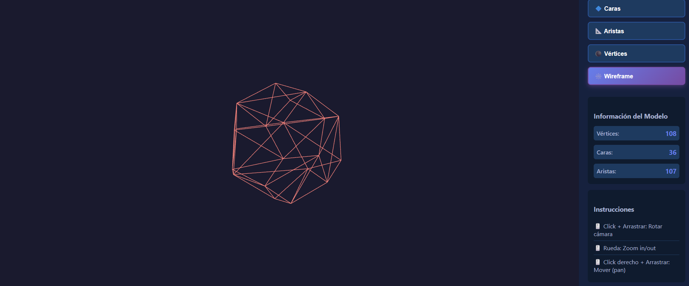
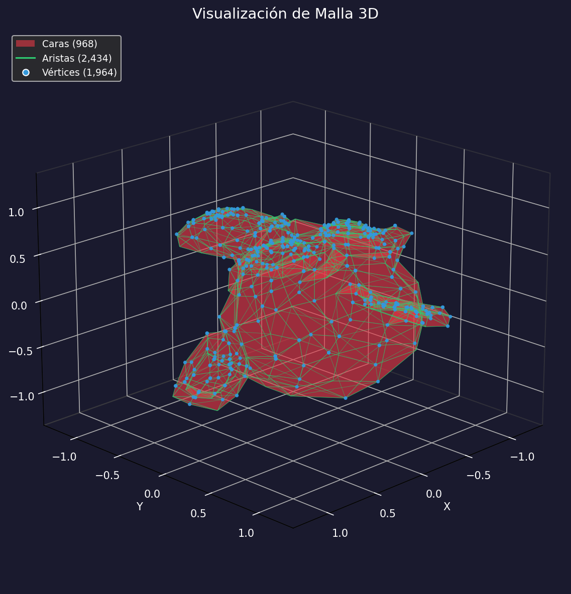

# Taller Construyendo Mundo 3D

**Estudiante:** Jerónimo Bermúdez Hernández  
**Fecha de entrega:** 21 de febrero de 2026

---

##  Descripción

Este taller explora las estructuras gráficas fundamentales que componen los modelos 3D, específicamente las mallas poligonales. Se implementaron soluciones en diferentes plataformas para visualizar y analizar **vértices**, **aristas** y **caras** de modelos 3D, utilizando formatos estándar como OBJ, STL y GLTF.

El objetivo principal fue comprender la anatomía de un modelo 3D y cómo diferentes herramientas permiten extraer, visualizar y manipular estos elementos estructurales básicos.

---

##  Implementaciones

### 1. Three.js con React Three Fiber

**Plataforma:** Web  
**Tecnologías:** Vite, React, React Three Fiber, @react-three/drei, TypeScript

#### Funcionalidades implementadas:

-  Carga de modelos 3D en formatos GLTF/GLB, OBJ y STL
-  Visualización interactiva con OrbitControls
-  Cuatro modos de visualización:
  - **Caras**: Renderizado sólido con materiales realistas
  - **Aristas**: Visualización de bordes destacados en color verde
  - **Vértices**: Representación de puntos individuales de la malla
  - **Wireframe**: Vista completa de malla de alambre
-  Panel de control interactivo para cambiar entre modos
-  Información estructural del modelo (número de vértices, caras y aristas)
-  Modelo de ejemplo integrado (dodecaedro) generado programáticamente

#### Características técnicas:

- Uso de `useGLTF`, `useLoader` con `OBJLoader` y `STLLoader`
- Componente `Edges` para resaltar aristas
- Componente `Points` para visualizar vértices
- Material `MeshStandardMaterial` con `wireframe={true}` para modo wireframe
- Cálculo automático de información de la geometría

**Código relevante:** Ver carpeta [threejs/](threejs/)

### 2. Python con Jupyter Notebook

**Plataforma:** Jupyter Notebook  
**Tecnologías:** Python, trimesh, vedo, numpy, matplotlib

#### Funcionalidades implementadas:

-  Carga de modelos 3D en formato OBJ usando `trimesh`
-  Extracción de información estructural:
  - Vértices (coordenadas en 3D)
  - Aristas únicas
  - Caras (triángulos)
-  Cálculo de la característica de Euler (V - E + F)
-  Visualización 3D con matplotlib
-  Representación de:
  - Caras como polígonos coloreados
  - Aristas como líneas
  - Vértices como puntos

#### Análisis realizado:

- Información cuantitativa del modelo (número de vértices, aristas y caras)
- Relación topológica entre elementos (fórmula de Euler)
- Visualización diferenciada de componentes estructurales

**Código relevante:** Ver notebook [python/T1S1.ipynb](python/T1S1.ipynb)

---

## Resultados Visuales

### Three.js - Visualizador Interactivo


*Fig 1: Interfaz del visualizador 3D con panel de control y modos de visualización*


*Fig 2: Demostración de los diferentes modos de visualización (caras, aristas, vértices, wireframe)*

### Python - Análisis de Mallas


*Fig 3: Visualización y análisis estructural de modelo 3D usando trimesh y matplotlib*

---

## Código Relevante

### Three.js - Modo de visualización de vértices

```tsx
{mode === 'vertices' && geometry && (
  <points>
    <bufferGeometry attach="geometry">
      <bufferAttribute
        attach="attributes-position"
        count={geometry.attributes.position.count}
        array={geometry.attributes.position.array}
        itemSize={3}
      />
    </bufferGeometry>
    <pointsMaterial
      size={0.05}
      color="#ff6b6b"
      sizeAttenuation={true}
    />
  </points>
)}
```

### Python - Extracción de información estructural

```python
# Extraer datos de la malla
vertices = mesh.vertices          # Coordenadas (N, 3)
faces    = mesh.faces             # Índices de triángulos (M, 3)
edges    = mesh.edges_unique      # Aristas únicas (E, 2)

n_vertices = len(vertices)
n_faces    = len(faces)
n_edges    = len(edges)

# Característica de Euler: V - E + F
euler = n_vertices - n_edges + n_faces

print(f'📊 Información del modelo:')
print(f'   Vértices: {n_vertices}')
print(f'   Aristas:  {n_edges}')
print(f'   Caras:    {n_faces}')
print(f'   Euler:    {euler}')
```

---

## 🤖 Prompts Utilizados

Durante el desarrollo de este taller se utilizaron prompts de IA generativa para:

1. **Configuración inicial del proyecto React Three Fiber**
   - "Crear un proyecto con Vite, React y React Three Fiber para visualizar modelos 3D"
   - "Configurar TypeScript con React Three Fiber y @react-three/drei"

2. **Implementación de modos de visualización**
   - "Cómo mostrar solo los vértices de un modelo 3D en React Three Fiber"
   - "Implementar visualización de aristas usando Edges en R3F"
   - "Crear panel de control para cambiar entre diferentes modos de visualización"

3. **Cálculo de información del modelo**
   - "Extraer número de vértices, caras y aristas de BufferGeometry en Three.js"
   - "Calcular aristas únicas desde la información de geometría"

4. **Python y trimesh**
   - "Cargar y visualizar modelos OBJ usando trimesh en Python"
   - "Visualizar vértices, aristas y caras con matplotlib en 3D"
   - "Explicar la característica de Euler para mallas poligonales"

5. **Documentación**
   - "Estructura de README.md completo para proyecto académico"
   - "Generar README con secciones de implementación y resultados visuales"

---

##  Aprendizajes y Dificultades

### Aprendizajes clave:

1. **Estructura de mallas poligonales:**
   - Comprendí que un modelo 3D es esencialmente un conjunto de vértices (puntos en el espacio) conectados por aristas (líneas) que forman caras (polígonos, usualmente triángulos).
   - La característica de Euler (V - E + F = 2) es una relación topológica fundamental que se cumple para mallas cerradas sin huecos.

2. **Diferencias entre plataformas:**
   - **Three.js/React**: Enfocado en renderizado en tiempo real y experiencia de usuario interactiva. La manipulación de BufferGeometry permite acceder directamente a los datos de la malla.
   - **Python/trimesh**: Ideal para análisis estructural, procesamiento de datos y visualización científica. Facilita el cálculo de propiedades topológicas.

3. **Formatos de archivo 3D:**
   - **OBJ**: Formato de texto, fácil de leer y entender la estructura.
   - **GLTF/GLB**: Formato moderno, optimizado para web, incluye materiales y animaciones.
   - **STL**: Simple, solo geometría (triángulos), común en impresión 3D.

4. **Visualización de elementos geométricos:**
   - Para mostrar vértices se utilizan sistemas de partículas (Points).
   - Para mostrar aristas se pueden usar Line segments o detectores de bordes.
   - El modo wireframe simplemente renderiza solo las aristas de cada triángulo.

### Dificultades encontradas:

1. **Cálculo de aristas en Three.js:**
   - Three.js no proporciona directamente el número de aristas únicas. Fue necesario implementar un algoritmo para extraer las aristas desde la información de caras y eliminar duplicados.
   - Solución: Crear un Set de aristas ordenadas para garantizar unicidad.

2. **Manejo de diferentes formatos:**
   - Cada loader (GLTF, OBJ, STL) devuelve estructuras ligeramente diferentes.
   - Solución: Normalizar el acceso a la geometría mediante una capa de abstracción.

3. **Visualización de vértices en React Three Fiber:**
   - Inicialmente los vértices no eran visibles debido al tamaño muy pequeño de los puntos.
   - Solución: Ajustar el tamaño de `pointsMaterial` y activar `sizeAttenuation`.

4. **Combinación de escenas en Python:**
   - Algunos modelos OBJ se cargan como `Scene` con múltiples objetos, no como un solo `Mesh`.
   - Solución: Detectar el tipo y concatenar todas las geometrías en una sola malla usando `trimesh.util.concatenate`.

5. **Sincronización de estados en React:**
   - Mantener sincronizado el estado del panel de control con la visualización 3D requirió un manejo cuidadoso de props y callbacks.
   - Solución: Usar un estado compartido en el componente padre (App) y pasar callbacks a componentes hijos.

### Conclusión:

Este taller proporcionó una comprensión profunda de los fundamentos de los gráficos 3D. La experiencia de implementar las mismas funcionalidades en diferentes plataformas (web y Python) permitió apreciar las fortalezas de cada herramienta y entender que, independientemente de la tecnología, los conceptos fundamentales (vértices, aristas, caras) permanecen invariantes.

---

##  Estructura del Proyecto

```
semana_1_1_construyendo_mundo_3d/
├── python/
│   └── T1S1.ipynb              # Notebook con análisis de mallas 3D
├── threejs/
│   ├── src/
│   │   ├── components/         # Componentes React
│   │   │   ├── Scene.tsx
│   │   │   ├── ModelViewer.tsx
│   │   │   ├── SimpleModel.tsx
│   │   │   └── ControlPanel.tsx
│   │   ├── App.tsx
│   │   └── main.tsx
│   ├── public/
│   │   └── models/             # Modelos 3D
│   ├── package.json
│   └── vite.config.ts
├── media/
│   ├── threejs.png             # Captura del visualizador web
│   ├── threejs.gif             # Demo animada de Three.js
│   └── python.png              # Captura del análisis en Python
└── README.md                   # Este archivo
```

---

##  Instrucciones de Ejecución

### Three.js

```bash
cd threejs
npm install
npm run dev
```

Visitar: `http://localhost:5173`

### Python

```bash
cd python
jupyter notebook T1S1.ipynb
```

O abrir directamente en Google Colab / VS Code.

---

## Referencias

- [React Three Fiber Docs](https://docs.pmnd.rs/react-three-fiber)
- [Three.js Documentation](https://threejs.org/docs/)
- [trimesh Documentation](https://trimsh.org/)
- [Understanding 3D Meshes](https://en.wikipedia.org/wiki/Polygon_mesh)
- [Euler Characteristic](https://en.wikipedia.org/wiki/Euler_characteristic)

---

**Repositorio:** `semana_1_1_construyendo_mundo_3d`  
**Commits:** Realizados en inglés siguiendo buenas prácticas de Git
